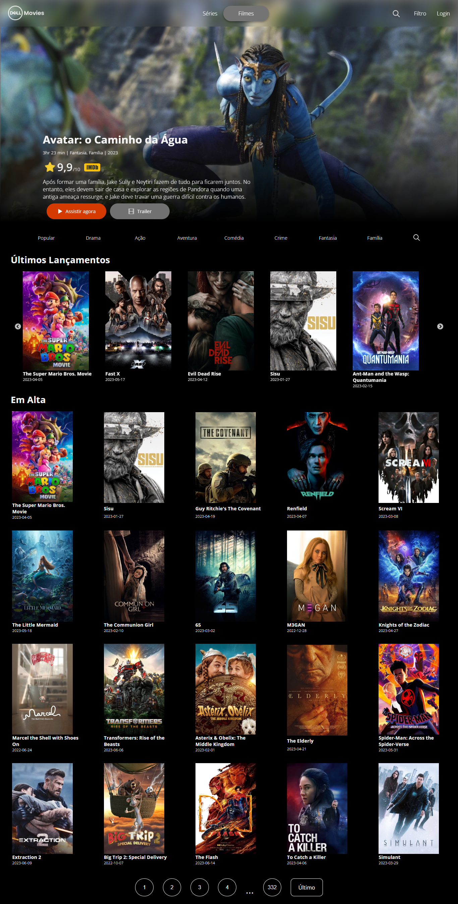

# Website - Portifólio

💻 Projeto Final do curso Vai na Web

<h1 align="center">
  
</h1>

## Infos

- Feito em React Js;
- Design responsivo;
- Consumo de API IMDb;

## Tecnologias utilizadas
- React js;
- Styled-Components;
- React Slick;
- Axios;